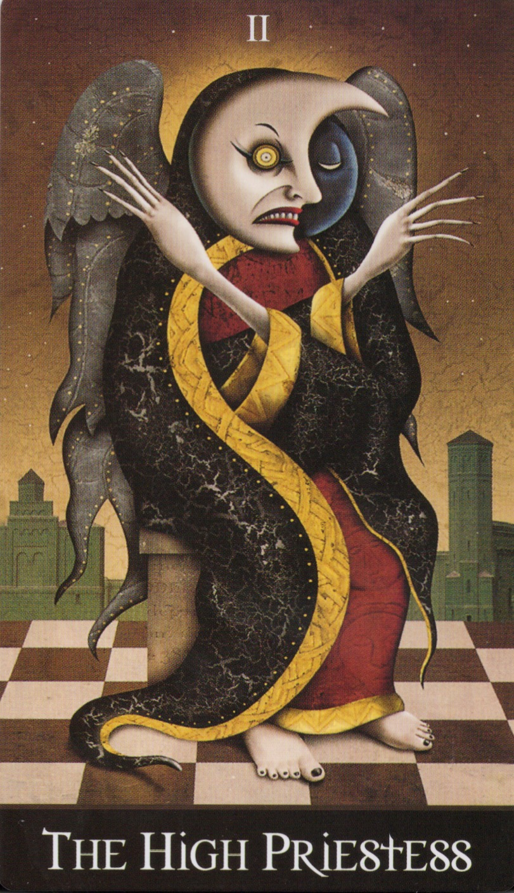

## 🧭 概要

このワークは「内なる十字路」において、自己の内面と向き合い、真実の声を見極めるための内的儀式です。
High Priestessのカードを用い、静寂の中で「選択する意志」を養います。

# Inner Circle of the Crossroads

## 🛑 Opening the Temple of the Crossroads

> **O Hekate, Keeper of the Thresholds,**  
> I stand at the edge of shadow and flame.  
> By your threefold torch, I call this place sacred—  
> A temple not of stone, but of will and silence.  
>  
> **I open the circle within,**  
> The inner gate of crossroads unseen.  
>  
> **Come, Lady of the Ways,**  
> Guide my steps between the worlds.  
>  
> （ヘカテよ、しきいの守り手よ——  
> 影と火の境にて私は立つ。  
> 三つの松明を掲げ、ここを聖域とする。  
> これは石の神殿ではなく、意志と沈黙の神殿。  
> 内なる円を開き、  
> 見えざる交差点の門をひらく。  
> 道の女神よ、  
> 世界と世界の間を歩む私を導いてください。）

*Draw an opening pentacle, starting from the top point to the lower left.*

## 🔮 Ritual

> **The card is placed at the center of the temple** —  
> A veil of silence spreads like moonlight on black water.  
> I gaze into the face of the High Priestess,  
> She who keeps the threshold not of time, but of knowing.  
> She does not speak — for truth needs no voice.  
>  
> **With each breath, I descend.**  
> Down through layers of thought,  
> past the masks of the everyday self,  
> until I come to the Crossroads Within.  
>  
> **There, I hear three voices rise:**  
> One of fear—"Stay where it's safe."  
> One of habit—"Do what you always do."  
> One of truth—silent, yet certain.  
>  
> **I listen not with ears, but with soul.**  
> And I choose the voice of truth.  
> The Crossroads shifts.  
> The path is no longer hidden.  
> I walk it with open eyes.  
>  
> （カードを神殿の中心に置く。  
> 静けさのヴェールが、黒い水面に差し込む月光のように広がる。  
> 私は女教皇の顔を見つめる。  
> 彼女は「知ること」の境界を守る存在。  
> 彼女は語らない——  
> 真理には言葉がいらないから。  
>  
> 息を重ねるたび、私は降りていく。  
> 思考の層をくぐり抜け、  
> 日常の仮面を通り過ぎ、  
> 内なる交差点にたどり着く。  
>  
> そこで、三つの声が浮かび上がる。  
> 恐れの声——「安全な場所にとどまれ」  
> 習慣の声——「いつも通りにすればいい」  
> 真実の声——沈黙の中に、確かな響きを持つ。  
>  
> 私は耳ではなく、魂でそれを聞く。  
> そして、真実の声を選ぶ。  
> 交差点が変わる。  
> 隠されていた道が現れる。  
> 私はその道を、目を開いて歩き始める。）  

## 🔚 Closing the Circle of the Work

> **O Hekate, Flame of the Crossroads,**  
> The work is done, the circle sealed.  
> What was opened with will, I close with grace.  
>  
> **Let what was true remain,**  
> Let what was illusion fall away.  
>  
> The path stands clear, and I walk on.  
> So mote it be.  
>  
> （十字路の炎であるヘカテよ、  
> 作業は終わり、円は閉じられる。  
> 意志で開いたものは、美しさで閉じる。  
> 真実は残り、幻想は去る。  
> 道はすでに明らかであり、私はそれを歩む。  
> そのようになりますように。）

*Draw a closing pentacle, starting from the lower left to the top point.*

## 🖼️ Tarot Card Reference

## 🔓 ライセンス

© 2025 知られざる呪術師（Le Sorcier Inconnu）  
本ドキュメントは [Creative Commons BY-SA 4.0](https://creativecommons.org/licenses/by-sa/4.0/deed.ja) に基づき公開されています。
